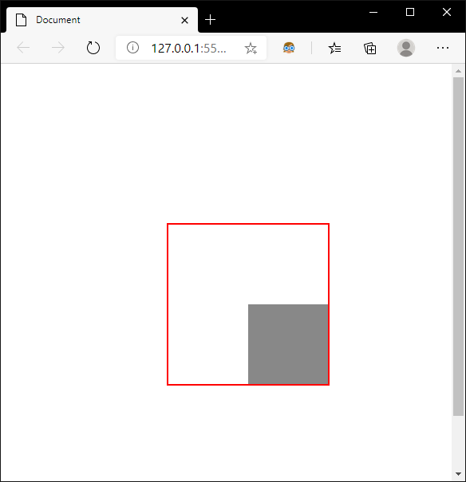

# 如何解决`position:fixed`固定定位偏移问题

## 问题

css固定定位`position:fixed`很容易使用，就是相对浏览器的viewport进行定位，`top:0;left:0`就是在左上角。

```html
<body>
  <div class="container">
  </div>	
</body>	
<style>
  .container{
    width: 100px;
    height: 100px;
    background: #888;
    position: fixed;
    top: 100px;
    left: 100px;
  }
</style>
```


当父级元素设置transform之后

```html
<body>
    <div class="BFC-box">
      <div class="container"></div>
    </div>
</body>
<style>
  .BFC-box{
    margin:200px;
    height: 200px;
    width: 200px;
    border:2px solid red;
    transform: scale(1);
  }
  .container{
    width: 100px;
    height: 100px;
    background: #888;
    position: fixed;
    top: 100px;
    left: 100px;
  }
</style>
```

fixed元素变成了相对父元素进行定位。



真是令人蛋疼，原因在于transform提升了元素的地位，在W3C规范中有如下说明：

**For elements whose layout is governed by the CSS box model, any value other than `none` for the transform also causes the element to become a containing block, and the object acts as a containing block for fixed positioned descendants**

在transform不为none的元素中，定位是会受到影响的。

## 解决方案

1. 在不影响布局的情况下，可以直接把要定位的元素移动到body下:

```html
<body>
  <div class="BFC-box"></div>
  <div class="container">
  </div>	
</body>	
```

2. 如果是在组件中不方便对元素进行操作，可以使用js，以vue为例:

```js
<div ref="container" class="container"></div>
mounted(){
  document.body.append(this.$refs['contaier'])
}

```


